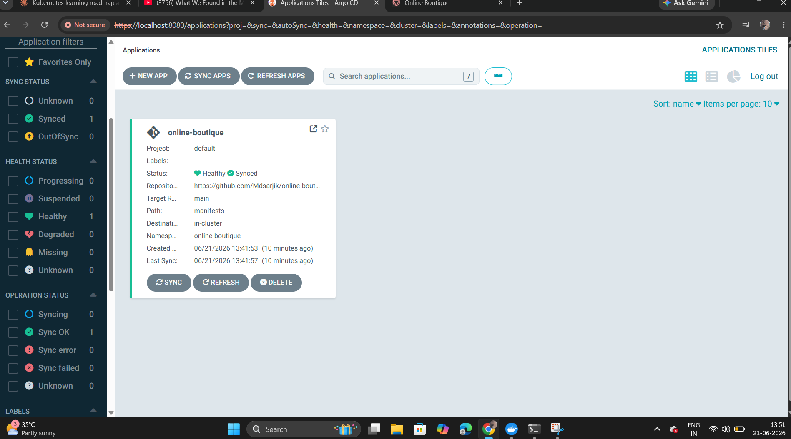

@"
# GitOps Continuous Delivery with ArgoCD on AWS EKS

## Overview
Implemented a GitOps continuous delivery workflow using ArgoCD 
to automatically deploy and synchronize an 11-microservice 
e-commerce application (Online Boutique) on AWS EKS — 
eliminating manual kubectl deployments.

## Problem Statement
Manual kubectl apply commands don't scale for teams and leave 
no audit trail of who changed what. GitOps solves this by making 
Git the single source of truth: any change pushed to a repository 
is automatically detected and deployed by ArgoCD, with full 
version history and instant rollback capability.

## Architecture
- AWS EKS cluster (3 worker nodes)
- ArgoCD installed in a dedicated namespace, continuously monitoring GitHub
- Application manifests stored in a separate Git repository
- Automated sync policy with self-healing and pruning enabled

## What I Implemented
- Installed ArgoCD on an EKS cluster via official manifests
- Defined the ArgoCD Application as code (YAML), not manual UI clicks
- Connected ArgoCD to a GitHub repository containing Kubernetes manifests
- Enabled automated sync: any Git change deploys automatically, no manual commands
- Demonstrated live GitOps automation: changed replica count directly 
  in GitHub and confirmed ArgoCD auto-deployed the change within minutes
- Verified application health and sync status through the ArgoCD dashboard

## Tech Stack
AWS EKS | ArgoCD | GitOps | Kubernetes | kubectl | YAML

## Proof of GitOps Automation

### ArgoCD Application — Healthy and Synced

### GitHub Commit Changing Replica Count

### Frontend Pods After Automatic Sync

## Key Learnings
- GitOps principles: Git as single source of truth
- Declarative application management with ArgoCD
- Automated, auditable, rollback-friendly deployments
- Difference between imperative (kubectl apply) and declarative (GitOps) delivery

## How to Reproduce
\`\`\`
kubectl create namespace argocd
kubectl apply -n argocd -f https://raw.githubusercontent.com/argoproj/argo-cd/stable/manifests/install.yaml
kubectl apply -f manifests/argocd-app.yml
\`\`\`

## Cleanup
\`\`\`
eksctl delete cluster --name argocd --region ap-south-1
\`\`\`
"@ | Out-File -FilePath "README.md" -Encoding utf8
